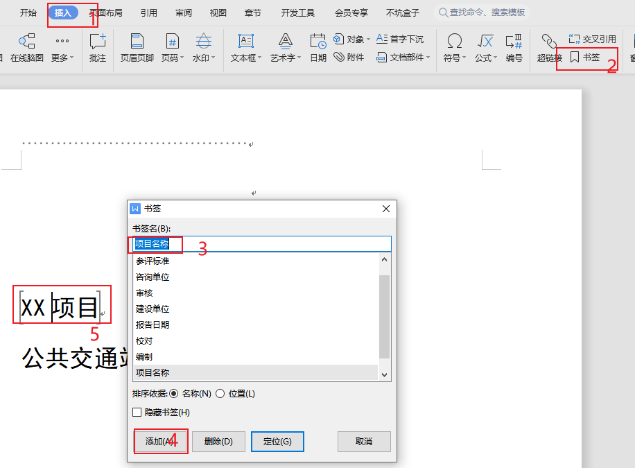
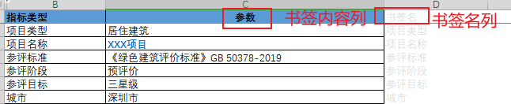
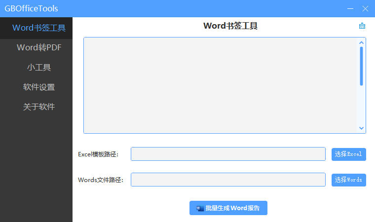
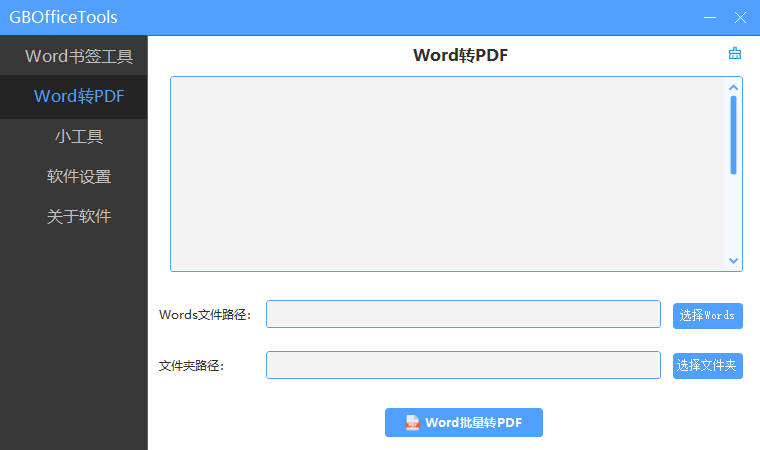

# GBOfficeTools软件说明与帮助

> GBOfficeTools旨在帮助提高办公效率，现已完成的功能有Word书签工具（书签名和书签内容输入Excel后，批量对含书签的Word模板书签内容进行替换）、Word转PDF工具（将Word文件批量转换成PDF文件，转换速度是WPS批量转PDF的3倍以上）。

## 1 Word书签工具

> 工作中常会遇到对同一个项目，需要编制各种论证分析报告、每个报告都有相同的项目名称、建设单位等内容，这些内容每个报告都需要输入一遍很是费时费力，有时候项目名称变更了还得挨个文件去修改，很是麻烦。为解决这一问题，经过数次迭代开发，完成了 “Word书签工具”，助您轻松高效办公。

### 1.1 操作方法

- 在所有Word模板中插入书签。

- 在Excel中插入书签名、书签内容。

- 点击“选择Excel”按钮，选择含有书签信息的Excel文件，然后点击“选择WordsF”按钮，选择插好书签的Word模板文件，最好点击“批量生成Word报告”按钮，稍等片刻即可批量生成Word报告。

### 1.2 软件特点

1. 批量生成Word文件、速度快。

## 2 Word转PDF

> 很多时候我们需要将Word文件转换为PDF格式进行发布。Word自带了另存为PDF文件的功能，但是如果由较多文件，一个一个另存还是比较麻烦、费时费力。网上也有一些批量转换的工具、但是需要搜索、下载等，甚至还需要收费、病毒等问题。为解决这些问题，经过数次迭代开发，完成了 “Word转PDF”工具，助您轻松高效办公。

### 2.1 操作方法

- **方法一：**点击“选择Words”按钮，然后选择需要转换的Word文件，再点击“Word批量转PDF”按钮，稍等片刻即可转换完成。

- **方法二：**点击“选择文件夹”按钮，然后选择需要转换的Word所在的文件夹，再点击“Word批量转PDF”按钮，稍等片刻即可转换完成。

### 2.2 软件特点

1. 不依赖Office、WPS等其他软件，电脑没有安装办公软件就可以进行转换。
2. 批量转换Word文件为PDF文件。
3. 软件采用并行运算，转换速度快，转换10个Word文件只需要2.8秒，转换速度是WPS批量转PDF的3倍以上。

### 2.3 操作动画

## 3 其他

- 关注公众号“可持续学园”，回复“GBOfficeTools”获取最新软件下载地址。

- 注意：软件运行时，涉及到的Word文件、Excel文件均需要关闭，不可打开。欢迎留言给出功能优化建议。